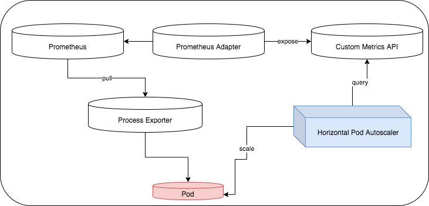

# prometheus-hpa

## The problem
This repository contains code to deploy an horizontal pod autoscaler on Kubernetes cluster that scales a Deployment according to a Custom Metric collected by Prometheus.



## Requirements
This requires a Kubernetes cluster v1.13 or higher. 

## Quick Start
First of all, Prometheus exporters are a number of libraries and servers which help in exporting existing metrics from third-party systems as Prometheus metrics. These could be stardard general-purpose exporters like [kube-eagle](https://github.com/cloudworkz/kube-eagle), or custom ones.
In order to deploy a kube-eagle exporter:
```
$ kubectl apply -f manifests/kube-eagle.yaml
```
In this tutorial we want also to deploy a custom exporter which exposes metrics associated to a specific pod, which will be scaled. The container inside that pod will be made of an httpgo server process and a custom process exporter which gets metrics from httpgo process. Let's deploy it:
```
$ kubectl apply -f manifests/httpgo.yaml
```

Then let's deploy an ingress, which will make httpgo pods accessible from outside the cluster:
```
$ kubectl apply -f manifests/ingress.yaml
```
    
Now we have to deploy a Prometheus server (https://prometheus.io/docs/introduction/overview/).
The one we will deploy will scrape kube-eagle and httpgo exporters (make sure you subsititute in ```manifests/prometheus.yaml```, ```kube-eagle-service-cluster-IP``` with the real value in your cluster, which could be obtained with ```$ kubectl describe service kube-eagle -n monitoring```

Then, let's deploy the Prometheus server
```
$ kubectl apply -f manifests/prometheus.yaml
```

The prometheus webUI is available at ```http://<masternode-publicIP>:<PrometheusService-nodePort>```.

As an example, let's deploy a [prometheus_adapter](https://github.com/DirectXMan12/k8s-prometheus-adapter) which is set to look for a particular metric (```myapphttpgo_load1``` which is the 1min-mean value of the load on that pod, and as an example is renamed as ```myapphttpgo_test```) and exposes it through Custom Metrics API. 

So, run
```
$ kubectl apply -f manifests/prometheus_adapter.yaml
```

The exposed metrics can be seen running:
```
$ kubectl get --raw /apis/custom.metrics.k8s.io/v1beta1/ | jq
{
  "kind": "APIResourceList",
  "apiVersion": "v1",
  "groupVersion": "custom.metrics.k8s.io/v1beta1",
  "resources": [
    {
      "name": "jobs.batch/myapphttp_test",
      "singularName": "",
      "namespaced": true,
      "kind": "MetricValueList",
      "verbs": [
        "get"
      ]
    }
  ]
```

Then, let's deploy an [horizontal pod autoscaler](https://kubernetes.io/docs/tasks/run-application/horizontal-pod-autoscale/) which is set to scale httpgo deployment according to the exposed metric. 
```
$ kubectl apply -f manifests/hpa.yaml
```

To see if scaling is active:
```
$ kubectl describe hpa
Name:                                                 httpgo-hpa
Namespace:                                            default
Labels:                                               <none>
Annotations:                                          CreationTimestamp:  Tue, 09 Jun 2020 12:57:32 +0200
Reference:                                            Deployment/httpgo
Metrics:                                              ( current / target )
  "myapphttp_test" on Job/httpgo-pod (target value):  190m / 500m
Min replicas:                                         1
Max replicas:                                         10
Deployment pods:                                      6 current / 6 desired
Conditions:
  Type            Status  Reason               Message
  ----            ------  ------               -------
  AbleToScale     True    ScaleDownStabilized  recent recommendations were higher than current one, applying the highest recent recommendation
  ScalingActive   True    ValidMetricFound     the HPA was able to successfully calculate a replica count from Job metric myapphttp_test
  ScalingLimited  False   DesiredWithinRange   the desired count is within the acceptable range
```

Finally, let's see scaling in action. Let's generate load on the system:
```
$ export GOPATH="$HOME/go"
$ PATH="$GOPATH/bin:$PATH"
$ go get -u github.com/rakyll/hey
$ hey -q 1000 -c 1 -z 1m <node_name>/http
```

And see if the pod has been scaled:
```
$ kubectl describe hpa
Name:                                                 httpgo-hpa
Namespace:                                            default
Labels:                                               <none>
Annotations:                                          CreationTimestamp:  Tue, 09 Jun 2020 12:57:32 +0200
Reference:                                            Deployment/httpgo
Metrics:                                              ( current / target )
  "myapphttp_test" on Job/httpgo-pod (target value):  570m / 500m
Min replicas:                                         1
Max replicas:                                         10
Deployment pods:                                      10 current / 10 desired
Conditions:
  Type            Status  Reason               Message
  ----            ------  ------               -------
  AbleToScale     True    ScaleDownStabilized  recent recommendations were higher than current one, applying the highest recent recommendation
  ScalingActive   True    ValidMetricFound     the HPA was able to successfully calculate a replica count from Job metric myapphttp_test
  ScalingLimited  True    TooManyReplicas      the desired replica count is more than the maximum replica count
Events:
  Type    Reason             Age   From                       Message
  ----    ------             ----  ----                       -------
  Normal  SuccessfulRescale  2m3s  horizontal-pod-autoscaler  New size: 2; reason: Job metric myapphttp_test above target
  Normal  SuccessfulRescale  107s  horizontal-pod-autoscaler  New size: 3; reason: Job metric myapphttp_test above target
  Normal  SuccessfulRescale  92s   horizontal-pod-autoscaler  New size: 6; reason: Job metric myapphttp_test above target
  Normal  SuccessfulRescale  77s   horizontal-pod-autoscaler  New size: 10; reason: Job metric myapphttp_test above target
  ```
 
