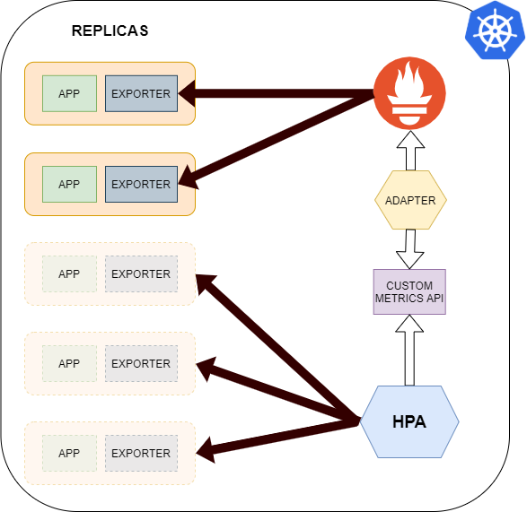
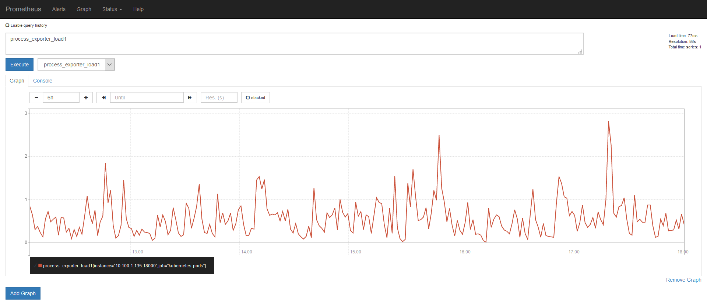

# Horizontal Autoscaling via Prometheus

This repository contains code to deploy an horizontal pod autoscaler on Kubernetes cluster that scales a Deployment according to a Custom Metric collected by Prometheus.



<a name="quickstart"></a>
## Quick Start
### How to deploy HPA
```
# deploy services
kubectl create namespace http
kubectl create namespace frontend
kubectl create namespace database
kubectl apply -f manifests_no_configs/httpgo_and_exporter.yaml -n http
kubectl apply -f manifests_no_configs/httpd_and_exporter.yaml -n frontend
kubectl apply -f manifests_no_configs/couchdb_and_exporter.yaml -n database

# deploy monitoring, here prometheus.yaml uses prometheus-example-cm
# and promeetheus_adapter.yaml uses prometheus-adapter-example-cm
kubectl create namespace monitoring
kubectl create configmap prometheus-example-cm --from-file configs/prometheus.yml -n monitoring
kubectl apply -f manifests_no_configs/prometheus.yaml
kubectl create configmap prometheus-adapter-example-cm --from-file configs/prometheus_adapter.yml -n monitoring
kubectl apply -f manifests_no_configs/prometheus_adapter.yaml

# deploy hpa
kubectl apply -f manifests_no_configs/hpa_hpptgo.yaml
kubectl apply -f manifests_no_configs/hpa_httpd.yaml
kubectl apply -f manifests_no_configs/hpa_couchdb.yaml
kubectl describe hpa

# check prometheus metrics
kubectl get --raw /apis/custom.metrics.k8s.io/v1beta1/ | jq
```

Here the `configs/prometheus_adapter.yml` contains all rules for hap metrics we'll use in
Prometheus, e.g. `process_open_fds` or `apache_accesses_total` or `couchdb_httpd_database_reads`.
The `configs/prometheys.yml` configuration sets the apps to monitor.
The `hpa_*.yaml` files contains horizontal pod autoscaler values to trigger on.

## Detailed procedure
This repository requires a Kubernetes 1.13 installation (to do this at CERN https://github.com/dmwm/CMSKubernetes/blob/master/kubernetes/cmsweb/docs/end-to-end.md).

We will go through an example which shows how to scale our applications according to the values of some metrics collected by Prometheus. 

To do this, frist of all we need some exporters that make metrics about our third-party apps available to Prometheus Server.

Prometheus will then regularly look for those exporters (scraping) and will save those metrics into "time series". 

In order to use those time series for autoscaling, we need a Prometheus Adapter that will get and manipulate those time series, and will then expose them through some API (Custom Metrics API). 

Now, k8s horizontal pod autoscalers can interact with Custom Metrics API and get those metrics values, creating replicas of our apps pods if those metrics values rise above some threshold. 

Therefore, in this example we will install a Prometheus Server which will scrape metrics from some exporters. Prometheus time series will be then exposed for horizontal pod autoscalers using a Prometheus Adapter deployment.

So, we will deploy three example apps with corresponding exporters, a Prometheus Server, a Prometheus Adapter and three different hpas, one for each app.
The three apps we will use are:
- ```httpgo server```: a basic HTTP server written in Go language (https://hub.docker.com/r/veknet/httpgo)
- ```httpd server```: one of the most famous open-source HTTP servers (https://httpd.apache.org/)
- ```couchDB```: an open-source document-oriented NoSQL database, implemented in Erlang (https://couchdb.apache.org/)

### Step-by-step configuration
First of all we need to deploy the three apps:
- ```httpgo server```: in this case, our deployment will use ```ttedesch/httpgo_exporter:latest``` image, which is built inserting process_exporter process inside ```veknet/httpgo``` image. Dockerfile, entrypoint and scripts used can be found [here](httpgo_exporter). A Nodeport service exposes port 31000 in order to make the httpgo reachable from outside.
  ```
  # This manifest is used to deploy an httpgo deployment and to deploy its service.
  # The image ttedesch/httpgo_exporter:latest contains an httpgo server and a process exporter that looks for httpgo process

  # create service
  apiVersion: v1
  kind: Service
  metadata:
    name: httpgo
  spec:
    type: NodePort        # port accessible from outside the cluster
    ports:
    - port: 8888 
      protocol: TCP
      name: http
      nodeport: 31000
    selector:
      app: httpgo
  ---
  # create httpgo (with exporter) deployment
  apiVersion: apps/v1 
  kind: Deployment
  metadata:
    name: httpgo
  spec:
    selector:
      matchLabels:
        app: httpgo
    replicas: 1
    template:
      metadata:
        labels:
          app: httpgo
      spec:
        containers:
        - name: httpgo-and-exporter
          image: ttedesch/httpgo_exporter:latest
          ports:
          - containerPort: 18883
          - containerPort: 8888
          imagePullPolicy: Always

        resources:
          requests:
            memory: "32Mi"
            cpu: "100m"
  ```
  ```
  kubectl apply -f manifests_no_configs/httpgo_and_exporter.yaml
  ```

- ```httpd server```: in this case, our deployment will use ```ttedesch/httpd:latest``` and ```bitnami/apache-exporter``` images. The first one is built using ```apt-get install apache2``` and setting mod_status, Dockerfile and config file used can be found [here](apache_server). A Nodeport service is used to make the httpd server reachable from outside.
  ```
  # This manifest is used to run a Deployment made of two containers: one running an httpd server and the other one running an apache exporter getting metrics from the       former.
  # Both containers are exposed through NodePort service.

  # create Service for httpd server
  apiVersion: v1
  kind: Service
  metadata:
    name: frontend-svc
  spec:
    type: NodePort        # port accessible from outside the cluster 
    ports:
    - name: http
      port: 80
      protocol: TCP
      targetPort: 80
    selector:
      app: frontend
  ---

  # create service for apache exporter 
  apiVersion: v1
  kind: Service
  metadata:
    name: frontend-exporter-svc
  spec:
    type: NodePort        # port accessible from outside the cluster 
    ports:
    - name: exporter
      port: 9117
      protocol: TCP
      targetPort: 9117
    selector:
      app: frontend
  ---

  # create httpd + apache exporter deployment
  apiVersion: extensions/v1beta1
  kind: Deployment
  metadata:
    name: frontend
  spec:
    replicas: 1
    template:
      metadata:
        labels:
          app: frontend
      spec:
        containers:
        - name: apache2
          #image: httpd:latest
          image: ttedesch/httpd:latest
          #image: ttedesch/httpd:extended_status
          ports:
          - containerPort: 80
        - name: apache-exporter
          #image: lusotycoon/apache-exporter
          image: bitnami/apache-exporter
          ports:
          - containerPort: 9117
          args: ["--scrape_uri=http://127.0.0.1/server-status/?auto"]
  ```
  
  ```
  kubectl apply -f manifests_no_configs/httpd_and_exporter.yaml
  ```

- ```couchDB```: in this case, our deployment will use ```couchdb:latest``` and ``` gesellix/couchdb-prometheus-exporter``` images. A Nodeport service is used to make the couchDB server reachable from outside.
  ```
  # This manifest is used to get a Deployment of two containers: one running a couchDB, the other running a couchDB exporter which scrapes metrics from the former.
  # Both containers are exposed through a NodePort service.

  # create NodePort service for couchDB 
  apiVersion: v1
  kind: Service
  metadata:
    name: db-frontend-svc
  spec:
    type: NodePort          # port accessible from outside the cluster 
    ports:
    - name: http
      port: 5984
      protocol: TCP
      targetPort: 5984
    selector:
      app: db-frontend
  ---

  # create NodePort service for couchDB exporter 
  apiVersion: v1
  kind: Service
  metadata:
    name: db-frontend-exporter-svc
  spec:
    type: NodePort          # port accessible from outside the cluster 
    ports:
    - name: exporter
      port: 9984
      protocol: TCP
      targetPort: 9984
    selector:
      app: db-frontend
  ---

  # create couchDB + couchDB exporter deployment 
  apiVersion: extensions/v1beta1
  kind: Deployment
  metadata:
    name: db-frontend
  spec:
    replicas: 1
    template:
      metadata:
        labels:
          app: db-frontend
      spec:
        containers:
        - name: couchdb
          image: couchdb
          ports:
          - containerPort: 5984
          args: ["--name=my-couchdb", "--volume=~/data:/opt/couchdb/data"]
          env:
          - name: COUCHDB_USER
            value: "admin"
          - name: COUCHDB_PASSWORD
            value: "password"
        - name: couchdb-exporter
          image: gesellix/couchdb-prometheus-exporter
          ports:
          - containerPort: 9984
          args: ["--couchdb.uri=http://127.0.0.1:5984", "--couchdb.username=admin",  "--couchdb.password=password"]
  ```
  ```
  kubectl apply -f manifests_no_configs/couchdb_and_exporter.yaml
  ```
  
Then, let's deploy the Prometheus Server. First of all we need to create the ConfigMap containing its configuration. In the Prometheus Server section you can see how to write a proper configuration file.

```
# rules to be fed to Prometheus in order to make it look for the desired exporters
global:
  scrape_interval: 10s
  evaluation_interval: 10s 

scrape_configs:

  - job_name: 'httpgo-pod'                    # look for an exporter inside "httpgo" pod (httpgo)
    kubernetes_sd_configs:
    - role: pod
    relabel_configs:
    - source_labels: [__meta_kubernetes_pod_label_app]
      action: keep
      regex: httpgo
      
  - job_name: 'apache_and_exporter-pod'       # look for an exporter inside "frontend" pod (httpd) 
    kubernetes_sd_configs:
    - role: pod
    relabel_configs:
    - source_labels: [__meta_kubernetes_pod_label_app]
      action: keep
      regex: frontend
      
  - job_name: 'couchdb_and_exporter-pod'      # look for an exporter inside "db-frontend" pod (couchDB)
    kubernetes_sd_configs:
    - role: pod
    relabel_configs:
    - source_labels: [__meta_kubernetes_pod_label_app]
      action: keep
      regex: db-frontend
```
```
kubectl create namespace monitoring
kubectl create configmap prometheus-example-cm --from-file configs/prometheus.yml -n monitoring
```
Then, let's deploy Prometheus server itself, mounting that ConfigMap as volume.
```
# This manifest is used to create Prometheus Deployment, Service, ClusterRole and ClusterRoleBinding

# create Prometheus deployment
apiVersion: extensions/v1beta1
kind: Deployment
metadata:
  name: prometheus
  namespace: monitoring
spec:
  replicas: 1
  template:
      metadata:
        labels:
          app: prometheus-server
      spec:
        containers:
        - name: prometheus
          image: prom/prometheus:v2.1.0
          volumeMounts:
          - name: config-volume
            mountPath: /etc/prometheus/prometheus.yml   
            subPath: prometheus.yml
          ports:
          - containerPort: 9090
        volumes:
        - name: config-volume
          configMap:
            name: prometheus-example-cm         # configmap containing configuration rules
---
# create NodePort service
apiVersion: v1
kind: Service
metadata:
  name: prometheus-service
  namespace: monitoring
  annotations:
    prometheus.io/scrape: 'true'
    prometheus.io/path:   /
    prometheus.io/port:   '8080'    
spec:
  selector: 
    app: prometheus-server
  type: NodePort        # port accessible from outside the cluster                                       
  ports:
  - port: 8080                                       
    targetPort: 9090 
    nodePort: 30999
    name: prom-web
---
# create Cluster Role
apiVersion: rbac.authorization.k8s.io/v1beta1
kind: ClusterRole
metadata:
  name: prometheus
rules:
- apiGroups: [""]
  resources:
  - nodes
  - nodes/proxy
  - services
  - endpoints
  - pods
  verbs: ["get", "list", "watch"]
- apiGroups:
  - extensions
  resources:
  - ingresses
  verbs: ["get", "list", "watch"]
- nonResourceURLs: ["/metrics"]
  verbs: ["get"]
---
# create ClusterRoleBinding
apiVersion: rbac.authorization.k8s.io/v1beta1
kind: ClusterRoleBinding
metadata:
  name: prometheus
roleRef:
  apiGroup: rbac.authorization.k8s.io
  kind: ClusterRole
  name: prometheus
subjects:
- kind: ServiceAccount
  name: default
  namespace: monitoring
```

```
kubectl apply -f manifests_no_configs/prometheus.yaml
```
Analogously, we need to configure and deploy the prometheus adapter deployment which will query prometheus and expose metrics through Custom Metrics API.
```
# rules to be fed to Prometheus Adapter in order to make it export through Custom Metrics API the desired metrics 
rules:
  - seriesQuery: 'myapphttp_process_open_fds'                 # time series name to look for inside Prometheus (myapphttp_process_open_fds, related to httpgo)
    resources:
      template: "<<.Resource>>"                               # assign resource (job)
    name:
      matches: "^(.*)"                                        # change name if necessary (keep as is)
      as: "${1}"
    metricsQuery: 'avg(<<.Series>>) by (job)'                 # manipulate result (average through all pods) 
    
  - seriesQuery: 'apache_accesses_total'                      # time series name to look for inside Prometheus (apache_accesses_total, related to httpd pod)
    resources:
      template: "<<.Resource>>"                               # assign resource (job)
    name:
      matches: "^(.*)_total"                                  # change name if necessary (change suffix from total to per_second)
      as: "${1}_per_second"
    metricsQuery: 'avg(rate(<<.Series>>[5m])) by (job)'       # manipulate result (calculate a rate per second using 5 minutes information and average through all pods) 
    
  - seriesQuery: 'couchdb_httpd_database_reads'               # time series name to look for inside Prometheus (couchdb_httpd_database_reads, related to couchDB)
    resources:
      template: "<<.Resource>>"                               # assign resource (job)
    name:
      matches: "^(.*)"                                        # change name if necessary (keep as is)
      as: "${1}"
    metricsQuery: 'avg(<<.Series>>) by (job)'                 # manipulate result (average through all pods) 
```
```
kubectl create configmap prometheus-adapter-example-cm --from-file configs/prometheus_adapter.yml
```
```
# This manifest is used to deploy Prometheus Adapter.
# Its configuration is provided through a ConfigMap.
# This manifest defines: 
#   - ServiceAccount, ClusterRole, ClusterRoleBinding, RoleBinding (to set permissions)
#   - Service 
#   - Deployment 
#   - APIService (Custom Metrics API)

# create ServiceAccount
apiVersion: v1
kind: ServiceAccount
metadata:
  labels:
    app: prometheus-adapter
    chart: prometheus-adapter-2.3.1
  name: prometheus-adapter
---

# create ClusterRole
apiVersion: rbac.authorization.k8s.io/v1
kind: ClusterRole
metadata:
  labels:
    app: prometheus-adapter
    chart: prometheus-adapter-2.3.1
  name: prometheus-adapter-server-resources
rules:
- apiGroups:
  - custom.metrics.k8s.io
  resources: ["*"]
  verbs: ["*"]
---
# create ClusterRole
apiVersion: rbac.authorization.k8s.io/v1
kind: ClusterRole
metadata:
  labels:
    app: prometheus-adapter
    chart: prometheus-adapter-2.3.1
  name: prometheus-adapter-resource-reader
rules:
- apiGroups:
  - ""
  resources:
  - namespaces
  - pods
  - services
  - configmaps
  verbs:
  - get
  - list
  - watch
---
# create ClusterRoleBinding
apiVersion: rbac.authorization.k8s.io/v1
kind: ClusterRoleBinding
metadata:
  labels:
    app: prometheus-adapter
    chart: prometheus-adapter-2.3.1
  name: prometheus-adapter:system:auth-delegator
roleRef:
  apiGroup: rbac.authorization.k8s.io
  kind: ClusterRole
  name: system:auth-delegator
subjects:
- kind: ServiceAccount
  name: prometheus-adapter
  namespace: "default"
---

# create ClusterRoleBinding
apiVersion: rbac.authorization.k8s.io/v1
kind: ClusterRoleBinding
metadata:
  labels:
    app: prometheus-adapter
    chart: prometheus-adapter-2.3.1
  name: prometheus-adapter-resource-reader
roleRef:
  apiGroup: rbac.authorization.k8s.io
  kind: ClusterRole
  name: prometheus-adapter-resource-reader
subjects:
- kind: ServiceAccount
  name: prometheus-adapter
  namespace: "default"
---

#create ClusterRoleBinding
apiVersion: rbac.authorization.k8s.io/v1
kind: ClusterRoleBinding
metadata:
  labels:
    app: prometheus-adapter
    chart: prometheus-adapter-2.3.1
  name: prometheus-adapter-hpa-controller
roleRef:
  apiGroup: rbac.authorization.k8s.io
  kind: ClusterRole
  name: prometheus-adapter-server-resources
subjects:
- kind: ServiceAccount
  name: prometheus-adapter
  namespace: "default"
---

# create RoleBinding
apiVersion: rbac.authorization.k8s.io/v1
kind: RoleBinding
metadata:
  labels:
    app: prometheus-adapter
    chart: prometheus-adapter-2.3.1
  name: prometheus-adapter-auth-reader
roleRef:
  apiGroup: rbac.authorization.k8s.io
  kind: Role
  name: extension-apiserver-authentication-reader
subjects:
- kind: ServiceAccount
  name: prometheus-adapter
  namespace: "default"
---

# create Service
apiVersion: v1
kind: Service
metadata:
  annotations:
    {}
  labels:
    app: prometheus-adapter
    chart: prometheus-adapter-2.3.1
  name: prometheus-adapter
spec:
  ports:
  - port: 443
    protocol: TCP
    targetPort: 6443
    nodePort: 30007                   # port accessible from outside the cluster
    #targetPort: https
  selector:
    app: prometheus-adapter
  type: NodePort

---

# create Deployment
apiVersion: apps/v1
kind: Deployment
metadata:
  labels:
    app: prometheus-adapter
    chart: prometheus-adapter-2.3.1
  name: prometheus-adapter
spec:
  replicas: 1
  selector:
    matchLabels:
      app: prometheus-adapter
  template:
    metadata:
      labels:
        app: prometheus-adapter
        chart: prometheus-adapter-2.3.1
      name: prometheus-adapter
    spec:
      serviceAccountName: prometheus-adapter
      containers:
      - name: prometheus-adapter
        image: "directxman12/k8s-prometheus-adapter-amd64:v0.6.0"
        imagePullPolicy: IfNotPresent
        args:
        - /adapter
        - --secure-port=6443
        - --cert-dir=/tmp/cert
        - --logtostderr=true
        - --prometheus-url=http://prometheus-service.monitoring.svc:8080/   # url to Prometheus service
        - --metrics-relist-interval=1m
        - --v=6
        - --config=/etc/adapter/prometheus_adapter.yml
        ports:
        - containerPort: 6443
          name: https
        volumeMounts:
        - mountPath: /etc/adapter/
          name: config-volume
          readOnly: true
        - mountPath: /tmp
          name: tmp
      volumes:
      - name: config-volume
        configMap:
          name: prometheus-adapter-example-cm               # configmap containing rules for Prometheus Adapter
      - name: tmp
        emptyDir: {}
---

# create ApiService
apiVersion: apiregistration.k8s.io/v1beta1
kind: APIService
metadata:
  labels:
    app: prometheus-adapter
    chart: prometheus-adapter-2.3.1
  name: v1beta1.custom.metrics.k8s.io
spec:
  service:
    name: prometheus-adapter
    namespace: "default"
  group: custom.metrics.k8s.io
  version: v1beta1
  insecureSkipTLSVerify: true
  groupPriorityMinimum: 100
  versionPriority: 100
```
```
kubectl apply -f manifests_no_configs/prometheus_adapter.yaml
```

In the end, let's deploy the three Horizontal Pod Autoscalers (httpgo, httpd, couchdb) which will scale those three apps according to specific metrics:
- httpgo: ```number of open file descriptors```
  ```
  # this manifest is used to deploy an hpa which scales httpgo deployment according to myapphttp_process_open_fds metric

  apiVersion: autoscaling/v2beta2
  kind: HorizontalPodAutoscaler
  metadata:
    name: httpgo-hpa
    namespace: default
  spec:
    scaleTargetRef:
      apiVersion: apps/v1
      kind: Deployment
      name: httpgo
    minReplicas: 1
    maxReplicas: 10
    metrics:

    - type: Object
      object:
        metric:
          name: myapphttp_process_open_fds
        describedObject:
          apiVersion: batch/v1
          kind: Job
          name: httpgo-pod
        target:
          type: Value
          value: 200    # threshold value
  ```
  ```
  kubectl apply -f manifests_no_configs/hpa_hpptgo.yaml
  ```
- httpd: ```number of accesses per second```
  ```
    # this manifest is used to deploy an horizontal pod autoscaler which scales httpd deployment according to apache_accesses_per_second metric

  apiVersion: autoscaling/v2beta2
  kind: HorizontalPodAutoscaler
  metadata:
    name: httpd-hpa
    namespace: default
  spec:
    scaleTargetRef:
      apiVersion: apps/v1
      kind: Deployment
      name: frontend
    minReplicas: 1
    maxReplicas: 10
    metrics:

    - type: Object
      object:
        metric:
          name: apache_accesses_per_second
        describedObject:
          apiVersion: batch/v1
          kind: Job
          name: apache_and_exporter-pod
        target:
          type: Value
          value: 0.5    # threshold value
   ```
   ```
  kubectl apply -f manifests_no_configs/hpa_httpd.yaml
  ```
  
- couchDB: ```number of reads```
  ```
  # this manifest is used to deploy an horizontal pod autoscaler which scales couchDB deployment according to couchdb_httpd_database_reads_per_second metric

  apiVersion: autoscaling/v2beta2
  kind: HorizontalPodAutoscaler
  metadata:
    name: couchdb-hpa
    namespace: default
  spec:
    scaleTargetRef:
      apiVersion: apps/v1
      kind: Deployment
      name: db-frontend
    minReplicas: 1
    maxReplicas: 10
    metrics:
    - type: Object 
      object:
        metric:
          name: couchdb_httpd_database_reads_per_second
        describedObject:
          apiVersion: batch/v1
          kind: Job
          name: couchdb_and_exporter-pod
        target:
          type: Value
          value: 0.5      # threshold value
  ```
  ```
  kubectl apply -f manifests_no_configs/hpa_couchdb.yaml
  ```

<a name="quickstart"></a>
### Bring up playground with script
Just type
```
./deploy.sh create
./deploy.sh scale
```
to deploy:
- three different apps:
  - a pod with httpgo server and a process exporter - exposed through NodePort service
  - a pod with httpd server and an apache exporter - exposed through NodePort service
  - a pod with CouchDB and a couchDB exporter - exposed through NodePort service
- a Prometheus server
- a Prometheus adapter pod
- three different horizontal pod autoscalers to scale each app (up to 10 replicas) accornding to a specific metric:
  - httpgo: ```number of open file descriptors```
  - httpd: ```number of accesses per second```
  - couchDB: ```number of reads```

*Here NodePort services are used in order to make apps reachable from outside the cluster.*

<a name="quickstart"></a>

<a name="quickstart"></a>
### How to test and debug
The prometheus webUI is available at ```http://<masternode-publicIP>:<PrometheusService-nodePort>```. A generic time series should look like this:


The exposed metrics can be seen running:
```
$ kubectl get --raw /apis/custom.metrics.k8s.io/v1beta1/ | jq
```
For example, in our case, the output should be:
```
{
  "kind": "APIResourceList",
  "apiVersion": "v1",
  "groupVersion": "custom.metrics.k8s.io/v1beta1",
  "resources": [
    {
      "name": "jobs.batch/couchdb_httpd_database_reads_per_second",
      "singularName": "",
      "namespaced": true,
      "kind": "MetricValueList",
      "verbs": [
        "get"
      ]
    },
    {
      "name": "jobs.batch/myapphttp_process_open_fds",
      "singularName": "",
      "namespaced": true,
      "kind": "MetricValueList",
      "verbs": [
        "get"
      ]
    },
    {
      "name": "jobs.batch/apache_accesses_per_second",
      "singularName": "",
      "namespaced": true,
      "kind": "MetricValueList",
      "verbs": [
        "get"
      ]
    }
  ]
}
```
Now let's see an example to see if autoscaling is active. We will use httpgo pod as an example.
In order to test the autoscaler, let's create an Ingress, which will balance incoming requests across all httpgo pods:
```
  
apiVersion: extensions/v1beta1
kind: Ingress
metadata:
  name: ingress
  namespace: default
  annotations:
    kubernetes.io/ingress.class: nginx
spec:
  rules:
  - host: "<name-of-your-node>.cern.ch"     # substitute <name-of-your-node> with the name of your worker node (you can use kubectl get node to obtain it)
    http:
      paths:
      - path: /http
        backend:
          serviceName: httpgo     # match httpgo service
          servicePort: 8888
```

Now let's generate load artificially on httpgo server using hey tool (https://github.com/vkuznet/hey)
```
go get -u github.com/rakyll/hey
export GOPATH="$HOME/go"
PATH="$GOPATH/bin:$PATH"
hey -q 10 -c 1000 -z 1m http://test-cluster-lciavsdzsham-node-0.cern.ch/http
```
This should increase the value of our metric (the average number of open fds of httpgo-pods) and trigger the autoscaler. To see it in action:
```
$ kubectl describe hpa
```
The output of the hpa for httpgo server should be something like this:
```
Name:                                                             httpgo-hpa
Namespace:                                                        http
Labels:                                                           <none>
Annotations:                                                      CreationTimestamp:  Wed, 15 Jul 2020 19:10:32 +0200
Reference:                                                        Deployment/httpgo
Metrics:                                                          ( current / target )
  "myapphttp_process_open_fds" on Job/httpgo-pod (target value):  269400m / 200
Min replicas:                                                     1
Max replicas:                                                     10
Deployment pods:                                                  6 current / 9 desired
Conditions:
  Type            Status  Reason              Message
  ----            ------  ------              -------
  AbleToScale     True    SucceededRescale    the HPA controller was able to update the target scale to 9
  ScalingActive   True    ValidMetricFound    the HPA was able to successfully calculate a replica count from Job metric myapphttp_process_open_fds
  ScalingLimited  False   DesiredWithinRange  the desired count is within the acceptable range
Events:
  Type    Reason             Age   From                       Message
  ----    ------             ----  ----                       -------
  Normal  SuccessfulRescale  39s   horizontal-pod-autoscaler  New size: 4; reason: Job metric myapphttp_process_open_fds above target
  Normal  SuccessfulRescale  24s   horizontal-pod-autoscaler  New size: 6; reason: Job metric myapphttp_process_open_fds above target
  Normal  SuccessfulRescale  9s    horizontal-pod-autoscaler  New size: 9; reason: Job metric myapphttp_process_open_fds above target
```

<a name="quickstart"></a>

## To expose additional metrics
To expose additional metrics just modify [configs/prometheus_adapter.yml](configs/prometheus_adapter.yml) adding rules for exporting the desired Prometheus metrics.

For example, just add:
```
rules:
  - seriesQuery: 'apache_cpuload'  
    resources:
      template: "<<.Resource>>"
    name:
      matches: "^(.*)"
      as: "${1}"
    metricsQuery: 'avg(<<.Series>>) by (job)'
```
to expose apache_cpuload metric averaged through all httpd pods.

# Components - in-depth view

<a name="quickstart"></a>
## Exporter 
This component retrives metrics coming from third-party's applications and make them available to Prometheus server. As an example we will see three different types of exporters associated to different kinds of applications.

<a name="quickstart"></a>
### Process Exporter
https://github.com/ncabatoff/process-exporter

Prometheus exporter that mines /proc to report on selected processes.

<a name="quickstart"></a>
### Apache Exporter
https://github.com/Lusitaniae/apache_exporter

Apache Exporter is a Prometheus exporter for Apache metrics that exports Apache server status reports generated by ```mod_status``` with the URL of ```http://127.0.0.1/server-status/?auto```.

<a name="quickstart"></a>
### CouchDB Exporter
https://github.com/gesellix/couchdb-prometheus-exporter

The CouchDB metrics exporter requests the CouchDB stats from the /_stats and /_active_tasks endpoints and exposes them for Prometheus consumption.

<a name="quickstart"></a>
## Prometheus
https://prometheus.io/docs/prometheus/latest/configuration/configuration/

This is the Prometheus server itself, which collects all metrics from various exporters in the form of time series. Those can be accessed and visualized through a WebUI.

A generic Prometheus configuration has to be written in YAML format.
For our purposes, the only sections we will use are:

- ```global```: This configuration specifies parameters that are valid in all other configuration contexts. They also serve as  defaults for other configuration sections.
- ```scrape_config```: This section specifies a set of targets and parameters describing how to scrape them. In the general case, one scrape configuration specifies a single job. In advanced configurations, this may change. Targets may be statically configured via the ```static_configs``` parameter or dynamically discovered using one of the supported service-discovery mechanisms:
  - ```static_configs```: configure targets statically
  - ```kubernetes_sd_configs```: Kubernetes SD configurations allow retrieving scrape targets from Kubernetes' REST API and always staying synchronized with the cluster state. One of the following role types can be configured to discover targets:
    - ```node```: The node role discovers one target per cluster node with the address defaulting to the Kubelet's HTTP port. The target address defaults to the first existing address of the Kubernetes node object in the address type order of NodeInternalIP, NodeExternalIP, NodeLegacyHostIP, and NodeHostName.
    - ```service```: The service role discovers a target for each service port for each service. This is generally useful for blackbox monitoring of a service. The address will be set to the Kubernetes DNS name of the service and respective service port.
    -  ```pod```: The pod role discovers all pods and exposes their containers as targets. For each declared port of a container, a single target is generated. If a container has no specified ports, a port-free target per container is created for manually adding a port via relabeling.
    - ```endpoint```: The endpoints role discovers targets from listed endpoints of a service. For each endpoint address one target is discovered per port. If the endpoint is backed by a pod, all additional container ports of the pod, not bound to an endpoint port, are discovered as targets as well.
    - ```ingress```: The ingress role discovers a target for each path of each ingress. This is generally useful for blackbox monitoring of an ingress. The address will be set to the host specified in the ingress spec.

<a name="quickstart"></a>
### Example
```
    global:                                                         # How frequently to scrape targets and evaluate rules by default
      scrape_interval: 10s
      evaluation_interval: 10s
    scrape_configs:                                                 
      
      - job_name: 'kube-eagle'                                      # Scrape an exporter statically using its service IP address and port, name this scraping job as 'kube-eagle'
        static_configs:                                             
            - targets: ['kube-eagle-service-cluster-IP:8080']
          
      - job_name: 'httpgo-pod'                                      # Scrape an exporter dynamically, looking for a pod with label app 'httpgo', name this scraping job as 'httpgo-pod'                                    
        kubernetes_sd_configs:                                           
        - role: pod
        relabel_configs:
        - source_labels: [__meta_kubernetes_pod_label_app]
          action: keep
          regex: httpgo
```
<a name="quickstart"></a>
## Prometheus Adapter
https://github.com/DirectXMan12/k8s-prometheus-adapter/blob/master/docs/config.md

The Prometheus Adapter application selects (and manipulates) certain time series from Prometheus Server and exposes them through Custom Metrics API in order to make them available to the Horizontal Pod Autoscaler.
The adapter takes the standard Kubernetes generic API server arguments (including those for authentication and authorization). By default, it will attempt to using Kubernetes in-cluster config to connect to the cluster.

It takes ```--config=<yaml-file>``` (```-c```) as an argument: this configures how the adapter discovers available Prometheus metrics and the associated Kubernetes resources, and how it presents those metrics in the custom metrics API.
The adapter determines which metrics to expose, and how to expose them, through a set of "discovery" rules which are made of four parts:
- ```Discovery```, which specifies how the adapter should find all Prometheus metrics for this rule. You can use two fields: 
  - ```seriesQuery```: specifies Prometheus series query (as passed to the /api/v1/series endpoint in Prometheus) to use to find some set of Prometheus series 
  - ```seriesFilters```: to do additional filtering on metric names
- ```Association```, which specifies how the adapter should determine which Kubernetes resources a particular metric is associated with. You can use the ```resources``` field.
There are two ways to associate resources with a particular metric, using two different sub-fields:
  - ```template```: specify that any label name that matches some particular pattern refers to some group-resource based on the label name. The pattern is specified as a Go template, with the ```Group``` and ```Resource``` fields representing group and resource. 
  - ```overrides```: specify that some particular label represents some particular Kubernetes resource. Each override maps a Prometheus label to a Kubernetes group-resource. 
- ```Naming```, which specifies how the adapter should expose the metric in the custom metrics API. You can use the ```name``` field, specifying a pattern to extract an API name from a Prometheus name, and potentially a transformation on that extracted value:
  - ```matches```: a regular expression (https://docs.python.org/3/library/re.html) that specifies pattern. If not specified, it defaults to ```.*```. 
  - ```as```: specifies the transformation. You can use any capture groups defined in the ```matches``` field. If the matches field doesn't contain capture groups, the ```as``` field defaults to ```$0```. If it contains a single capture group, the ```as``` field defaults to ```$1```. Otherwise, it's an error not to specify the ```as``` field.
- ```Querying```, which specifies how a request for a particular metric on one or more Kubernetes objects should be turned into a query to Prometheus. You can use the ```metricsQuery``` field, specifying a Go template that gets turned into a Prometheus query, using input from a particular call to the custom metrics API. A given call to the custom metrics API is distilled down to a metric name, a group-resource, and one or more objects of that group-resource. These get turned into the following fields in the template:
  - ```Series```: the metric name
  - ```LabelMatchers```: a comma-separated list of label matchers matching the given objects. Currently, this is the label for the particular group-resource, plus the label for namespace, if the group-resource is namespaced.
  - ```GroupBy```: a comma-separated list of labels to group by. Currently, this contains the group-resource label used in ```LabelMatchers```.

<a name="quickstart"></a>
### Example
```
  rules:
  - seriesQuery: 'testmetric_total{instance="10.100.1.135:18000",job="kubernetes-pods"}'          # DISCOVERY of testmetric_total time series with certain instance and job labels
    resources:
      template: "<<.Resource>>"                                                                   # ASSOCIATION of that metric to the resource which is present in the labels (job.batch)
    name:
      matches: "^(.*)_total"                                                                      # NAMING of the metric: modify the last part of the name, from testmetric_total to testmetric_per_second
      as: "${1}_per_second"
    metricsQuery: 'sum(rate(<<.Series>>{<<.LabelMatchers>>}[2m])) by (<<.GroupBy>>)'              # QUERYING of the metric, calculating a rate value averaged every 2 minutes and summing up                                                                    
```

<a name="quickstart"></a>
## Horizontal Pod Autoscaler
https://kubernetes.io/docs/tasks/run-application/horizontal-pod-autoscale-walkthrough/#autoscaling-on-multiple-metrics-and-custom-metrics

By making use of the autoscaling/v2beta2 API version you can introduce metrics to use when autoscaling a deployment. The Horizontal Pod Autoscaler is implemented as a control loop that periodically queries a metrics API. There are three types of metrics:

- ```Resource metrics```: based on CPU or memory usage of a pod, exposed through ```metrics.k8s.io``` API (```Resource type```)

- ```Custom metrics```: based on any metric reported by a Kubernetes object in a cluster, exposed through ```custom.metrics.k8s.io``` API 
  - ```Pod type```: describe pods, and are averaged together across pods and compared with a target value to determine the replica count. 
  - ```Object type```: describe a different object in the same namespace, instead of describing pods. The metrics are not necessarily fetched from the object; they only describe it.
  
- ```External metrics```: based on a metric from an application or service external to your cluster, exposed through ```external.metrics.k8s.io``` API (```External type```).

<a name="quickstart"></a>
### Example
```
apiVersion: autoscaling/v2beta2     
kind: HorizontalPodAutoscaler
    metadata:                               # metadata of the autoscaler
  name: httpgo-hpa 
  namespace: http
spec:
  scaleTargetRef:                           # spec of the Kubernetes resource to be scaled (in this case a Deployment)
    apiVersion: apps/v1   
    kind: Deployment
    name: httpgo
  minReplicas: 1                            # max and min number of replicas of that resource
  maxReplicas: 10
  metrics:                                  # spec of the metric used for scaling (in this case a Job Object)
  - type: Object
    object:                               
      metric:
        name: myapphttp_process_open_fds
      describedObject:
        apiVersion: batch/v1
        kind: Job
        name: httpgo-pod
      target:                               # threshold value
        type: Value
        value: 200
 ```
 

